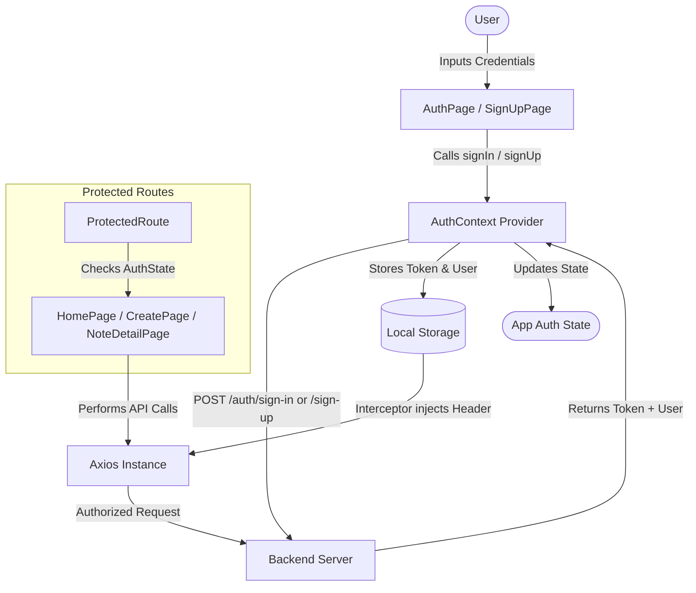

# ThinkBoard Frontend Authentication Integration Guide

This guide details the integration of User Authentication (Sign Up, Sign In, and Sign Out) on the ThinkBoard React frontend.

---

## 🏗️ State Architecture & Data Flow

The authentication architecture is built on **React Context** combined with an **Axios interceptor** for seamless HTTP communication.



1. **Persistent Session**: On page boot, the application scans `localStorage` for pre-existing tokens and user records, ensuring session persistence without forcing login redirects upon page reloads.
2. **Global Auth Context**: Re-usable hooks (`useAuth`) expose auth parameters and helper methods to components.
3. **Route Guarding**: A custom `<ProtectedRoute>` layout prevents unauthorized navigation to dashboard resources.
4. **Header Injection**: Axios request interceptors automatically include the `Authorization` header on all outgoing API calls.

---

## 📂 Core Additions & Modifications

### 1. New Context & Utilities

#### 🆕 `frontend/src/context/AuthContext.jsx`
Manages token storage, user properties, and authentication state (`signUp`, `signIn`, `signOut`).
- **Sign Up**: Hits `/auth/sign-up` and logs user in immediately.
- **Sign In**: Hits `/auth/sign-in` and saves JWT and profile payload.
- **Sign Out**: Invalidates browser cookies on the backend `/auth/sign-out` and destroys local storage credentials.

#### 🆕 `frontend/src/components/ProtectedRoute.jsx`
Shields internal pages. Redirects visitors to `/auth` if the user object is absent from the context state. Displays a loader during authentication checks.

---

### 2. Styling and Pages

#### 🆕 `frontend/src/pages/AuthPage.jsx`
The portal for returning members to access their dashboard. Features:
- Glassmorphism form overlay.
- Email and password input elements with real-time UI validations.
- Submitting state and loading spinner indicator on button presses.
- Hyperlinks redirection to `/signup`.

#### 🆕 `frontend/src/pages/SignUpPage.jsx`
The workspace registration view. Features:
- Comprehensive full-name, email, and password controls.
- Validation checks for minimum password length (>= 6 characters).
- Submitting state feedback matching the design theme.

---

### 3. Integrated Updates to Existing Files

#### ✏️ `frontend/src/lib/axios.js`
Injected request interceptors to automatically fetch the token key and load it as a Bearer authorization token header.
```javascript
api.interceptors.request.use((config) => {
    const token = localStorage.getItem("token");
    if (token) {
        config.headers.Authorization = `Bearer ${token}`;
    }
    return config;
});
```

#### ✏️ `frontend/src/main.jsx`
Wrapped the main application within `<AuthProvider>` so children nested in the browser router gain full access to authentication methods.

#### ✏️ `frontend/src/App.jsx`
Configured route definitions and placed note-taking pages under the protected wrapper:
```jsx
<Route path="/" element={<ProtectedRoute><HomePage /></ProtectedRoute>} />
<Route path="/create" element={<ProtectedRoute><CreatePage /></ProtectedRoute>} />
<Route path="/notes/:id" element={<ProtectedRoute><NoteDetailPage /></ProtectedRoute>} />
<Route path="/auth" element={<AuthPage />} />
<Route path="/signup" element={<SignUpPage />} />
```

#### ✏️ `frontend/src/components/Navbar.jsx`
Consumes `useAuth` hook:
- Welcomes user by name if signed in: `"Hello, [Name]"`.
- Implements the "Sign Out" button inside the navbar.

#### ✏️ `frontend/src/pages/CreatePage.jsx`
Modified note-creation logic to transmit the active `userId` inside the JSON payload to link the note to the author:
```javascript
await api.post("/notes", {
    title,
    content,
    userId: user?.userId,
});
```

---

## 🚀 Running the Application

1. **Start MongoDB**: Make sure your database instance is active.
2. **Start Backend**:
   ```bash
   cd backend
   npm run dev
   ```
   *Note: Runs on `http://localhost:5500`.*
3. **Start Frontend**:
   ```bash
   cd frontend
   npm run dev
   ```
   *Note: Runs on `http://localhost:5173`.*
